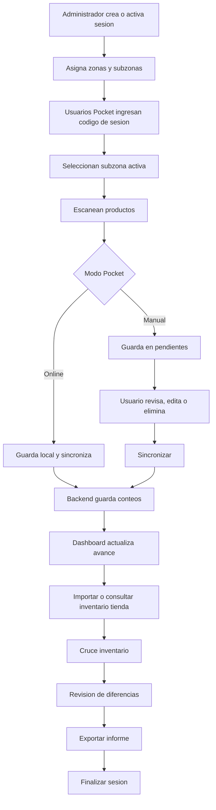
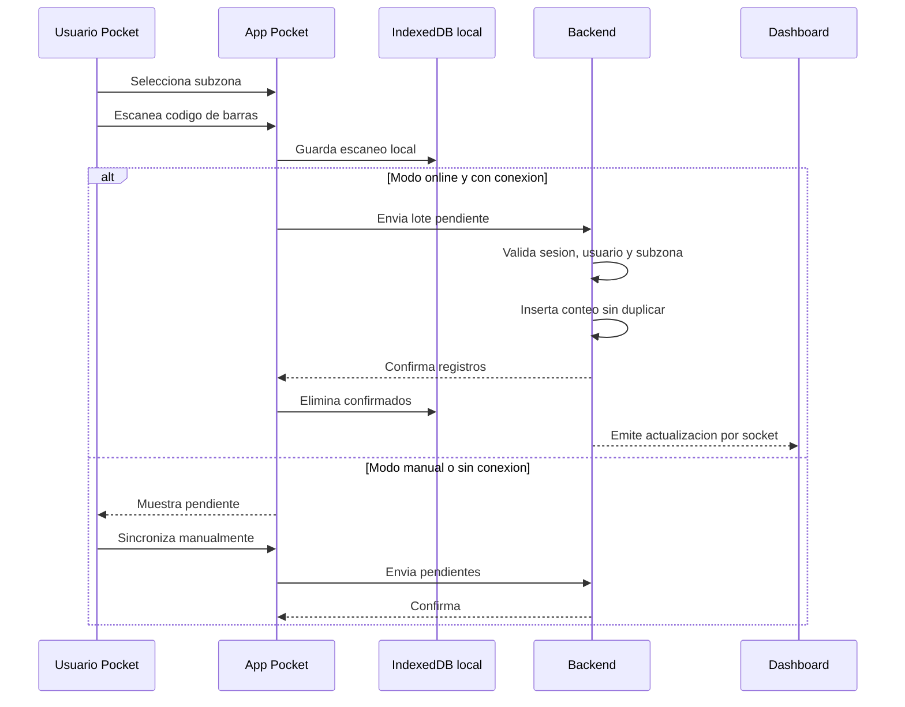
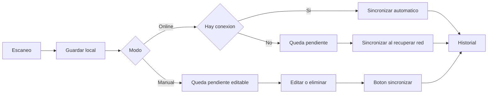
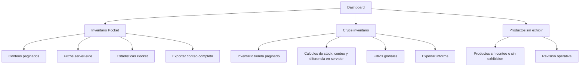
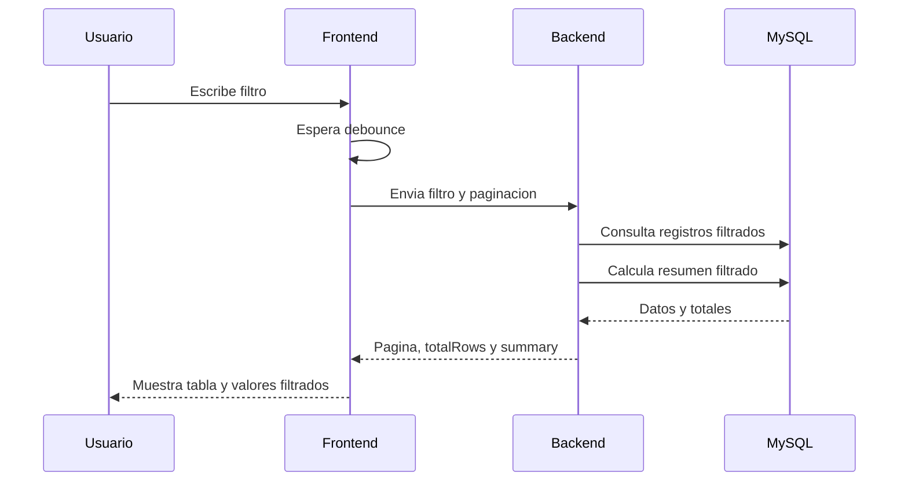
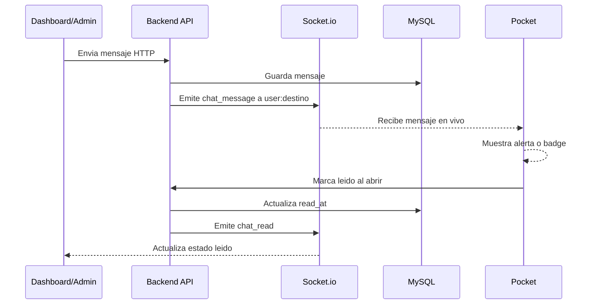
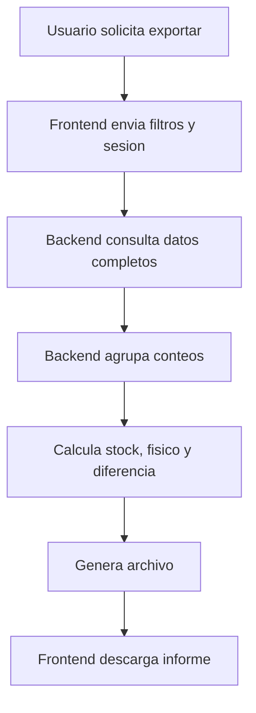
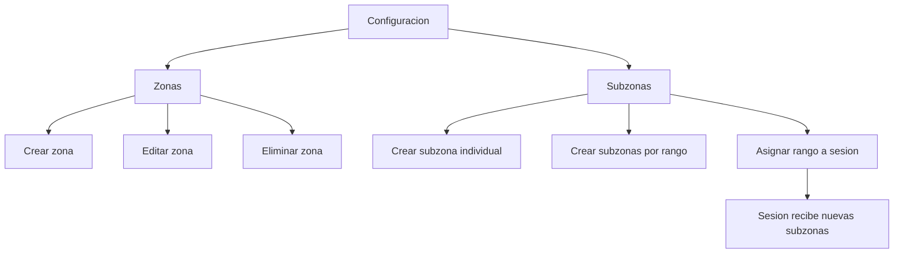
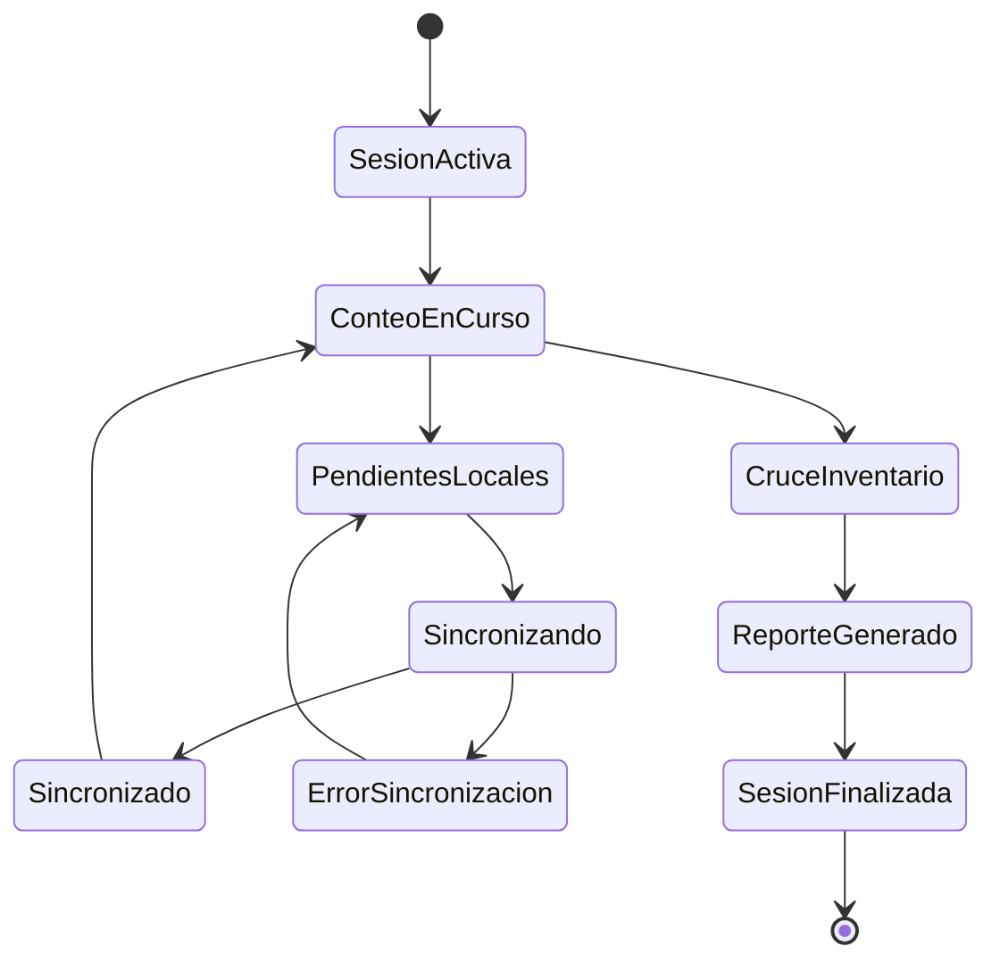

# Diagramas de uso del sistema de inventario

Los siguientes diagramas usan sintaxis Mermaid. Pueden visualizarse en GitHub, GitLab, VS Code con extension Mermaid o herramientas compatibles.

## 1. Flujo general de inventario

## 2. Flujo de escaneo Pocket

## 3. Modo online vs modo manual

## 4. Dashboard y cruce de inventario

## 5. Filtros y calculos

## 6. Chat por socket

## 7. Exportacion de informe

## 8. Configuracion de zonas y subzonas

## 9. Estados principales

