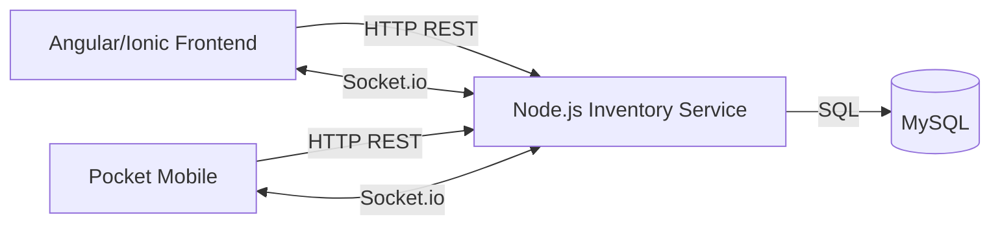

# Guia tecnica y operativa - Sistema de Inventario

## 1. Componentes principales

### Frontend

Proyecto Angular/Ionic:

`metasperu.inventory`

Responsabilidades:

- Login y navegacion por rol.
- Pocket de escaneo.
- Dashboard de monitoreo.
- Cruce de inventario.
- Configuracion de zonas/subzonas.
- Chat y notificaciones.
- Exportaciones iniciadas desde interfaz.

### Backend

Servicio Node.js/Express:

`metasperu-backend/inventory-service`

Responsabilidades:

- API de sesiones.
- API de conteos Pocket.
- API de inventario tienda.
- API de reportes y exportaciones.
- API de mantenimiento.
- Persistencia en MySQL.
- Socket.io para actualizaciones en vivo y chat.

### Base de datos

MySQL.

Contiene usuarios, sesiones, inventario, conteos, zonas, subzonas, mensajes y tablas auxiliares.

## 2. Arquitectura logica



## 3. Scripts de desarrollo

### Frontend

```bash
npm install
npm run build
npm start
```

Para exponer Angular por red local o Tailscale:

```bash
ng serve --host 0.0.0.0 --port 4900
```

### Backend

```bash
npm install
npm start
```

En desarrollo con nodemon:

```bash
npm run dev
```

## 4. Configuracion de endpoints

Actualmente existen URLs directas en servicios Angular.

Puntos importantes:

- `InventoryService` usa API de inventario.
- `PocketInventoryService` usa API de sincronizacion Pocket.
- `InventorySocketService` usa Socket.io.
- `PocketChat` usa API de chat.

Recomendacion tecnica:

Centralizar URLs en archivos de entorno:

- `environment.ts`
- `environment.prod.ts`

Variables sugeridas:

```ts
export const environment = {
  production: false,
  inventoryApiUrl: 'http://localhost:3001/s3/inventory',
  socketUrl: 'http://localhost:3001',
  socketPath: '/socket.io'
};
```

Para produccion:

```ts
export const environment = {
  production: true,
  inventoryApiUrl: 'https://api.metasperu.net.pe/s3/inventory',
  socketUrl: 'https://api.metasperu.net.pe',
  socketPath: '/s3/socket/'
};
```

## 5. Socket.io

El socket se usa para:

- Actualizar conteos en dashboard.
- Responder solicitudes de inventario tienda.
- Enviar mensajes de chat en vivo.
- Notificar lectura de mensajes.

### Eventos principales

| Evento | Direccion | Uso |
| --- | --- | --- |
| `join_session` | Frontend -> Backend | Unir dashboard a sala de sesion |
| `update_totals` | Backend -> Frontend | Avisar nuevos conteos |
| `res_inv_store` | Backend -> Frontend | Entregar inventario de tienda |
| `chat_message` | Backend -> Frontend | Mensaje de chat en vivo |
| `chat_read` | Backend -> Frontend | Confirmacion de lectura |

### Salas

- Sala de sesion: codigo de sesion en mayusculas.
- Sala de usuario: `user:<id>`.

## 6. Sincronizacion Pocket

### Principios

- Cada escaneo se guarda primero en IndexedDB.
- El envio al backend se hace por lotes.
- Cada registro debe tener identificador de cliente para evitar duplicados.
- Solo se eliminan del local los registros confirmados por servidor.
- En modo manual se permite editar o eliminar antes de enviar.

### Riesgos a controlar

- Doble escaneo accidental.
- Red intermitente.
- Usuario cambia subzona y sigue escaneando.
- Sesion finalizada mientras hay pendientes.
- Envio repetido por reintentos.

## 7. Rendimiento

El sistema debe evitar cargar grandes volumenes completos en el navegador.

Buenas practicas aplicadas o recomendadas:

- Paginacion server-side.
- Filtros server-side.
- Calculos de resumen en backend.
- Exportaciones desde servidor.
- Debounce en filtros.
- Evitar recalcular 100 mil registros en Angular.

### Limites recomendados

- Tabla visual: 10, 20, 50, 100, 500 maximo segun caso.
- Exportacion: servidor, no frontend.
- Conteo: enviar por lotes.
- Dashboard: mostrar solo pagina actual y totales calculados.

## 8. Base de datos e indices

Indices recomendados segun uso:

### Conteos Pocket

- `session_code`
- `session_code, sku`
- `session_code, seccion_id`
- `session_code, user_id`
- `client_scan_id` o identificador idempotente

### Inventario tienda

- `cSessionCode`
- `cSessionCode, cCodigoBarra`
- `cSessionCode, cCodigoBarra2`
- `cSessionCode, cCodigoBarra3`
- `cSessionCode, cSeccion`
- `cSessionCode, cDepartamento`

### Chat

- `recipient_id, read_at, id`
- `sender_id, recipient_id, id`
- `sender_id, client_id` unico para reintentos

## 9. Reportes

Los reportes deben generarse desde backend cuando el volumen sea alto.

Hojas recomendadas:

- Resumen.
- Inventario general.
- Informe de diferencias.
- Codigos no reconocidos.
- No escaneados.
- Stock negativo.
- Conteo por zona/subzona.
- Rendimiento por usuario Pocket.

## 10. Seguridad

### Autenticacion

- API protegida con JWT.
- Socket debe recibir token y asociar usuario a sala privada.
- El chat debe validar permisos antes de enviar.

### Recomendaciones

- Mover secreto JWT a variable de entorno.
- Rotar claves periodicamente.
- No dejar credenciales en codigo fuente.
- Usar HTTPS en produccion.
- Limitar CORS en produccion a dominios permitidos.
- Registrar auditoria de importaciones y cierres de sesion.

## 11. Monitoreo

Monitorear:

- CPU.
- Memoria.
- Heap usage Node.
- Event loop lag.
- Latencia HTTP p95.
- Reinicios de proceso.
- Conexiones MySQL activas.
- Consultas lentas.
- Tamano de tablas de conteo.

## 12. Checklist de despliegue

Antes de publicar:

- Ejecutar build frontend.
- Ejecutar `node --check` en archivos backend modificados.
- Reiniciar backend si se modifico socket o rutas.
- Confirmar conexion WebSocket.
- Probar login.
- Probar Pocket online.
- Probar Pocket manual.
- Probar dashboard.
- Probar filtros.
- Probar exportacion.
- Probar chat dashboard -> Pocket y Pocket -> dashboard.

## 13. Pruebas funcionales recomendadas

### Pocket

- Escaneo normal con pistola.
- Registro por cantidad.
- Cambio de subzona.
- Modo online con conexion.
- Modo online sin conexion.
- Modo manual con editar/eliminar.
- Sincronizacion de pendientes.
- Historial.

### Dashboard

- Carga de cards globales.
- Filtro exacto por subzona.
- Paginacion.
- Estadisticas.
- Rendimiento por Pocket.
- Exportacion completa.

### Chat

- Mensaje dashboard a Pocket.
- Mensaje Pocket a dashboard.
- Chat minimizado con mensaje entrante.
- Badge de no leidos.
- Enter para enviar.
- Shift + Enter para salto de linea.

## 14. Incidentes y diagnostico

### No llegan mensajes por socket

Verificar:

- WebSocket conectado en DevTools.
- Frontend y backend apuntan al mismo servidor.
- Token JWT enviado en `auth`.
- Backend reiniciado despues de cambios.
- Sala `user:<id>` creada al conectar.

### Dashboard se queda cargando

Verificar:

- Requests pendientes en Network.
- Error HTTP 500 o timeout.
- Consulta SQL lenta.
- Filtros enviados.
- Paginacion.

### Exportacion lenta

Verificar:

- Si se esta generando en frontend o backend.
- Cantidad de registros.
- Indices de base de datos.
- Tiempo de consulta SQL.

### Conteo incorrecto

Verificar:

- Si el codigo existe en inventario con ceros a la izquierda.
- Si se esta agrupando por codigo principal, codigo barra 2 o codigo barra 3.
- Si hay codigos no reconocidos.
- Si existe reconteo o zonas excluidas.
- Si las diferencias se calculan como conteo menos stock.

## 15. Recomendaciones futuras

- Centralizar configuracion de URLs.
- Agregar migraciones SQL versionadas.
- Agregar pruebas automatizadas para calculos de diferencias.
- Agregar logs de exportacion.
- Agregar cola de trabajos para reportes muy grandes.
- Agregar panel de auditoria de cambios.
- Agregar control de permisos granular por rol.
- Agregar versionado visible del frontend y backend.
